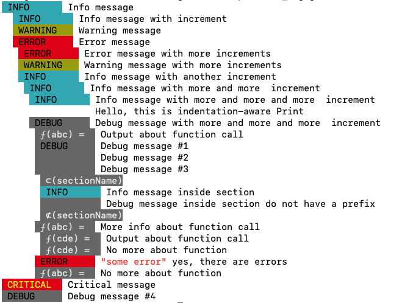
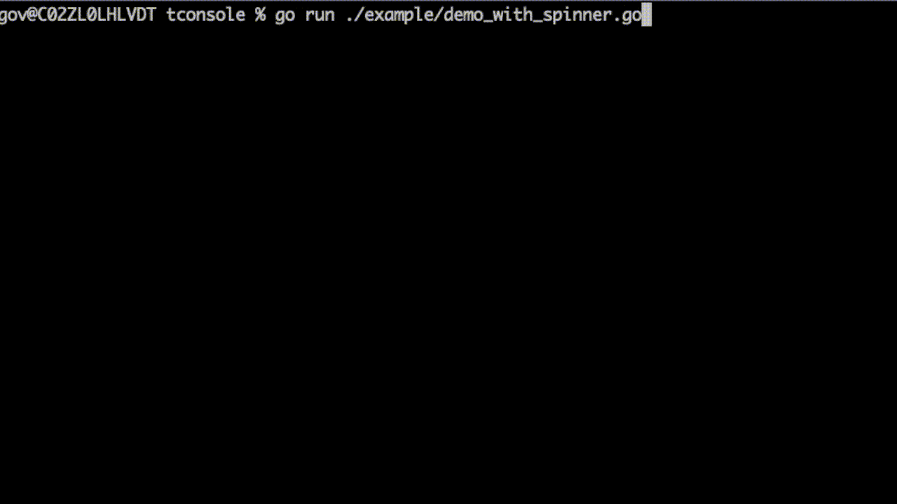

# Console prettification project

Every time, when you create a console application, you are potentially and quite often do interact with another human being who is a user of that tool. To have a meaningful, convenient and intuitive console user interface is still a responsibility of the instrument developer, and to use _fmt.Println()_ as a primary tool for text UI creation is not a perfect choice. While some tools do not require any elaborate UI, as the output of that tool is in fact an input of other tool, sometimes, console output of some program do actually intended to be used by a human, and _tconsole_ golang module will help you to make a better user experience.

## Which type of the UI, you can create with tconsole ?

Or let say, what is tconsole "is not". _tconsole_ module is not a "text User Interface" with text menu, windows and other elements of full screen tUI. This module rather help you to replace _fmt.Println()_ with something more user friendly.



_tconsole_ provides you Print()-like interface that's permitting to print a prefixed messages on text console with indentation that assist with grouping of the output messages. Color-coded prefixes will help you to categorize different types of the messages. You can even add a spinner that will show you the timed messages at the bottom of the screen.

## How to use it ?

First, you are going to install it

### Installation

```
go get github.com/vulogov/tconsole
```

Full source code is available at [https://github.com/vulogov/tconsole](https://github.com/vulogov/tconsole)

### Display color-prefixed messages

Color-prefixed messages will help you to send an Info/Error/Warning/Debug messages on text console. _tconsole_ is not a log replacement, it doesn't send anything except prefix and a message.

```golang

import "github.com/vulogov/tconsole"

func main() {

  c, _ := tconsole.New(nil)
  c.Info("Info message")
  c.Warning("Warning message")
  c.Error("Error message")
  c.Debug("Debug message")
}
```

### Indenting the messages.

You can increase and decrease message indentation to create a visually identifiable message groups.

```golang

import "github.com/vulogov/tconsole"

func main() {

  c, _ := tconsole.New(nil)
  c.Info("Info message")
  c.Inc() // Increase message indentation
  c.Warning("Warning message")
  c.Error("Error message")
  c.Dec() // Deecrease message indentation
  c.Debug("Debug message")
}
```

### Declaring indented sections in the output

You can create named indented sections in your output.

```golang

import "github.com/vulogov/tconsole"

func main() {

  c, _ := tconsole.New(nil)
  c.Info("Info message")
  c.Section("SectionName", "This section processing very important data") // Create section in output
  c.Warning("Warning message")
  c.Error("Error message")
  c.SectionEnd() // Ending section
  c.Debug("Debug message")
}
```

### Debugging the functions

Oftentimes, you do need to create named sections specifically to send a debug output about some functions

```golang

import "github.com/vulogov/tconsole"

func main() {

  c, _ := tconsole.New(nil)
  c.Info("Info message")
  c.Function("functionName", "This function processing very important data") // Create indented section in output for the named function
  c.Warning("Warning message")
  c.F("Function is doing just fine") // Send some function-related messages
  c.Error("Error message")
  c.Fclose() // Ending function
  c.Debug("Debug message")
}
```

### And adding a spinner

Spinned is a timed message box at the bottom of the screen. It is created by default and you have to stop it by calling .Stop() function.



and here is demonstration of what the spinner is looks like.

```golang

import "github.com/vulogov/tconsole"

func main() {
  c, _ := tconsole.New(nil)
  c.Message("Doing #1") // Sending a message to a spinner
  c.Warning("Warning message") // You can mix'n'match messages to a spinner and to a console
  c.Message("Doing #2") // Sending message to spinner again. Previous message duplicated on a console.
  c.Stop() // Do not forget to stop the spinner
}

```
